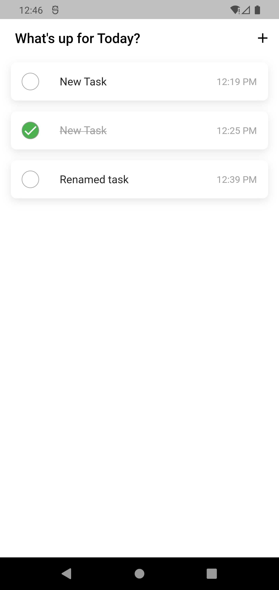

# hive_todo_app

Minimal flutter todo app with [Hive](https://pub.dev/packages/hive)

## Key Concepts

- Understanding [Hive](https://pub.dev/packages/hive) Concepts
- TypeAdaptors with hive
- Inherited widgets
- Create, Edit, Delete, Update hive object

## Packages

- UUID `creating ids for hive boxes`
- HIVE `no sql dart database`

```
  -- [] Generate box from model
    --- `flutter pub run build_runner build --delete-conflicting-outputs`
```

- DATETIME PICKER `pick a date time`

### ScreenShot


